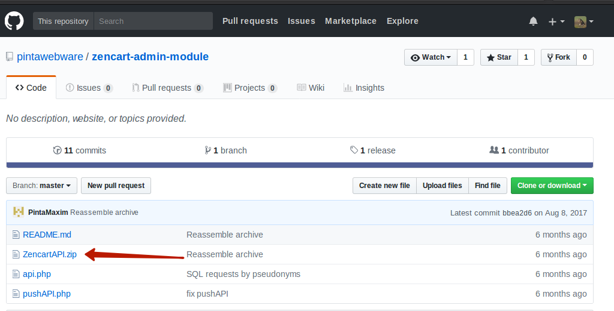
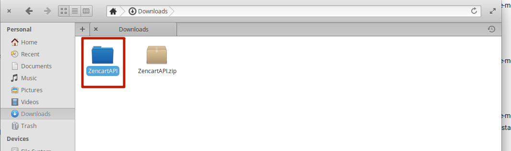
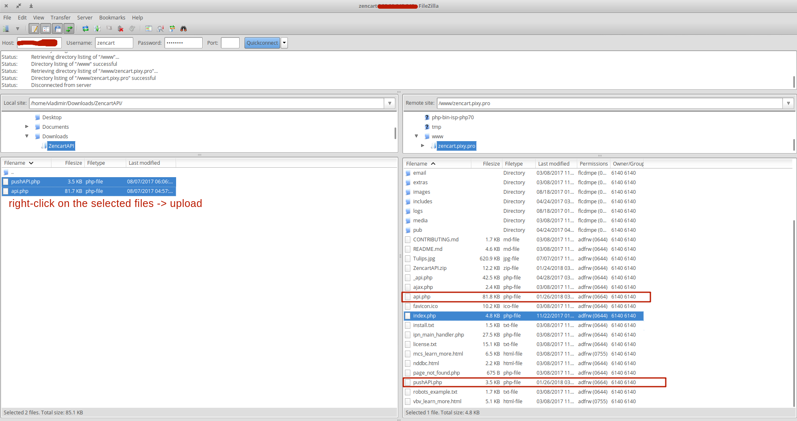
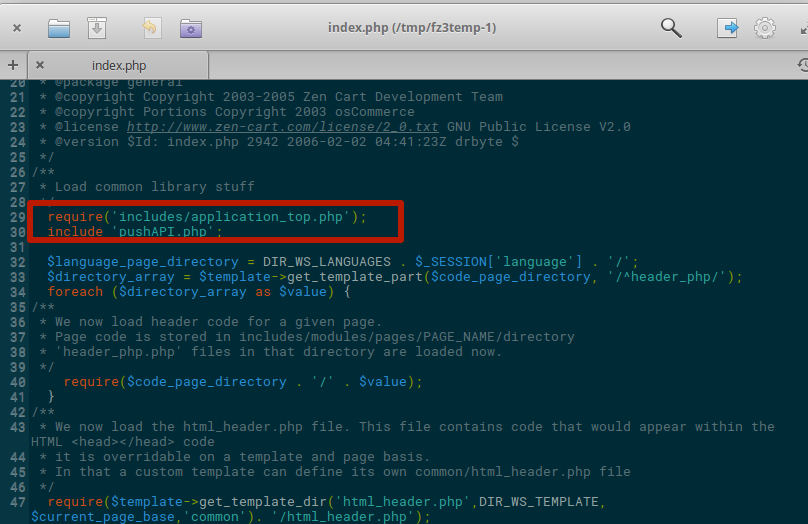

ZENCART-MOBILE-ADMIN 
=====================

Module for Zen cart version 2.0.0 and higher, containing the API for managing the online store from a mobile device.

== Installation ==

### To install extension on your website, you need to:

1. Follow the link https://github.com/pintawebware/zencart-admin-module and download the extension:

2. Extract the contents of the archive

3. Open FileZilla, connect to your server and copy the extracted files to the root directory of the site (in the same place as index.php);

5. Edit the index.php file of the root directory of the site: after the line "require('includes/application_top.php');" write "include ('pushAPI.php');"

Installation is done.

#### Use this link to download applications:
* [Google Play](https://play.google.com/store/apps/details?id=com.pinta.zencart.zencartmobileadmin)
* [AppStore](https://itunes.apple.com/ua/app/zencart-mobile-admin/id1232184830?l=ru&mt=8)

For log in app, please, use **admin email** and password.